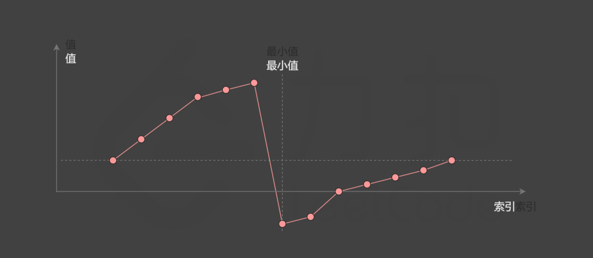

# 二分查找

### 35 搜索插入位置
最基础的二分查找，找回了高中的感觉,注意对于left right的更新需要时mid+1 mid-1,而不是mid,否则会死循环

```cpp
class Solution {
public:
    int searchInsert(vector<int>& nums, int target) {
        int left = 0;
        int right = nums.size() - 1;
        int mid;
        while (left <= right) {
            mid = (left + right) / 2;
            if (nums[mid] < target) {
                left = mid+1;
            } else if (nums[mid] > target) {
                right = mid-1;
            } else {
                return mid;
            }
        }
        return left;
    }
};
```


### 74 搜索二维矩阵
就是把一维矩阵变成了二维，注意mid_row mid_col的计算方式，mid_row = mid / n, mid_col = mid % n

```cpp
class Solution {
public:
    bool searchMatrix(vector<vector<int>>& matrix, int target) {
        int m = matrix.size();
        int n = matrix[0].size();
        int left = 0;
        int right = m * n - 1;
        int mid;
        int mid_row, mid_col;
        while (left <= right) {
            mid = (left + right) / 2;
            mid_row = mid / n;
            mid_col = mid % n;
            // cout<< "row"<<mid_row<<"col"<<mid_col<<endl;
            // cout <<matrix[mid_row][mid_col]<<endl;

            if (matrix[mid_row][mid_col] < target) {
                left = mid + 1;
            } else if (matrix[mid_row][mid_col] > target) {
                right = mid - 1;
            } else {
                return true;
            }
        }
        return false;
    }
};
```


标答中给出了一种新的方法，使用第一列元素先确定所在行，再在该行二分
```cpp
class Solution {
public:
    bool searchMatrix(vector<vector<int>> matrix, int target) {
        auto row = upper_bound(matrix.begin(), matrix.end(), target, [](const int b, const vector<int> &a) {
            return b < a[0];
        });
        if (row == matrix.begin()) {
            return false;
        }
        --row;
        return binary_search(row->begin(), row->end(), target);
    }
};

作者：力扣官方题解
链接：https://leetcode.cn/problems/search-a-2d-matrix/solutions/688117/sou-suo-er-wei-ju-zhen-by-leetcode-solut-vxui/
来源：力扣（LeetCode）
著作权归作者所有。商业转载请联系作者获得授权，非商业转载请注明出处。
```


### 34 在排序数组中查找元素的第一个和最后一个位置
使用2次二分查找，第一次找到第一个位置，第二次找到最后一个位置，只需要变换一下mid的判断方式即可，但是注意target不存在的情况，需要判断然后返回

还是答案的直接定义一个函数两次调用比较简洁清晰
```cpp
class Solution { 
public:
    int binarySearch(vector<int>& nums, int target, bool lower) {
        int left = 0, right = (int)nums.size() - 1, ans = (int)nums.size();
        while (left <= right) {
            int mid = (left + right) / 2;
            if (nums[mid] > target || (lower && nums[mid] >= target)) {
                right = mid - 1;
                ans = mid;
            } else {
                left = mid + 1;
            }
        }
        return ans;
    }

    vector<int> searchRange(vector<int>& nums, int target) {
        int leftIdx = binarySearch(nums, target, true);
        int rightIdx = binarySearch(nums, target, false) - 1;
        if (leftIdx <= rightIdx && rightIdx < nums.size() && nums[leftIdx] == target && nums[rightIdx] == target) {
            return vector<int>{leftIdx, rightIdx};
        } 
        return vector<int>{-1, -1};
    }
};

作者：力扣官方题解
链接：https://leetcode.cn/problems/find-first-and-last-position-of-element-in-sorted-array/solutions/504484/zai-pai-xu-shu-zu-zhong-cha-zhao-yuan-su-de-di-3-4/
来源：力扣（LeetCode）
著作权归作者所有。商业转载请联系作者获得授权，非商业转载请注明出处。
```

### 33 搜索旋转排序数组
本题中主要的难点在于数组的顺序是被旋转的，但是有个性质是从中切开后至少有一个是有序的，从而我们可以先判断mid左右哪个是有序的，然后在有序部分判断target是否在有序部分，如果在则继续二分查找，否则在另一部分继续二分查找

```cpp
class Solution {
public:
    int search(vector<int>& nums, int target) {
        int n = nums.size();
        int left = 0;
        int right = n - 1;
        int mid;
        while (left <= right) {
            mid = (left + right) / 2;
            // 左边有序
            if (nums[mid] == target) {
                return mid;
            }
            if (nums[mid] >= nums[left]) {
                if (target >= nums[left] && target <= nums[mid]) {
                    right = mid - 1;
                } else {
                    left = mid + 1;
                }
            } else {
                if (target >= nums[mid + 1] && target <= nums[right]) {
                    left = mid + 1;
                } else {
                    right = mid - 1;
                }
            }
        }

        return -1;
    }
};
```

### 153 寻找旋转排序数组中的最小值
这题感觉跟33差不多，我的思路还是先判断mid左右哪个有序，然后在有序部分取最小值来跟min比一比，再在无序部分继续二分查找，直到找到最小值

```cpp
class Solution {
public:
    int findMin(vector<int>& nums) {
        int n = nums.size();
        int left = 0;
        int right = n-1;
        int mid ;

        int min_val = 100000;
        while (left<=right){
            mid = (left+right)/2;
            //找有序
            if (nums[mid]>=nums[left]){
                if (nums[left]<min_val){
                    min_val = nums[left];
                    
                }
                left = mid+1;
            }else{
                if (nums[mid]<min_val){
                    min_val = nums[mid];
                }
                right = mid-1;
            }
        }

        return min_val;
    }
};
```

答案思路：
关键性质：最小值大于左边所有，小于右边所有

图示图片是一般情况的符合描述的数组，那么对于中点和left,right 的关系有以下几种情况：
1. mid >= right 说明最小值在mid右边
2. mid < right 说明最小值在mid或其左边

```cpp
class Solution {
public:
    int findMin(vector<int>& nums) {
        int low = 0;
        int high = nums.size() - 1;
        while (low < high) {
            int pivot = low + (high - low) / 2;
            if (nums[pivot] < nums[high]) {
                high = pivot;
            }
            else {
                low = pivot + 1;
            }
        }
        return nums[low];
    }
};

作者：力扣官方题解
链接：https://leetcode.cn/problems/find-minimum-in-rotated-sorted-array/solutions/698479/xun-zhao-xuan-zhuan-pai-xu-shu-zu-zhong-5irwp/
来源：力扣（LeetCode）
著作权归作者所有。商业转载请联系作者获得授权，非商业转载请注明出处。
```