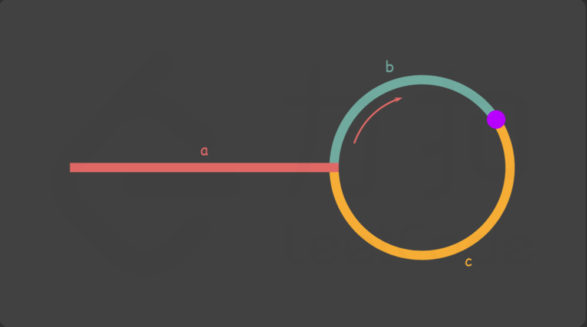

# 链表

## 介绍
链表是一种线性数据结构，由一系列节点组成，每个节点包含数据和指向下一个节点的引用（指针）。与数组不同，链表中的元素在内存中不必是连续存储的，这使得链表在插入和删除操作上更为高效。

## 常见操作（C++）
链表的常见操作包括插入、删除、查找和遍历。以下是一个简单的链表节点结构定义：
```cpp
struct ListNode {
     int val;
     ListNode *next;
     ListNode(int x) : val(x), next(NULL) {}
 };

// 插入节点
void insert(ListNode** head, int newData) {
    ListNode* newNode = new ListNode(newData);
    newNode->next = *head;
    *head = newNode;
}

//遍历
void traverse(ListNode* node) {
    while (node != NULL) {
        std::cout << node->val << " ";
        node = node->next;
    }
}

```


### 160 相交链表

法一：哈希表存储法
```cpp
/**
 * Definition for singly-linked list.
 * struct ListNode {
 *     int val;
 *     ListNode *next;
 *     ListNode(int x) : val(x), next(NULL) {}
 * };
 */
class Solution {
public:
    ListNode *getIntersectionNode(ListNode *headA, ListNode *headB) {
        unordered_set<ListNode *> visitied;
        ListNode* temp = headA;
        while (temp!=nullptr){
            visitied.insert(temp);
            temp  = temp->next;
        }

        temp = headB;
        while (temp!=nullptr){
            if (visitied.count(temp)){
                return temp;
            }
            temp = temp->next;
        }
        return nullptr;
    }
};
```
法二：双指针法
headA和headB分别从两个链表的头开始遍历，当到达链表末尾时，跳转到另一个链表的头继续遍历。这样，当两个指针相遇时，就是相交节点；如果没有相交节点，最终会同时到达链表末尾的nullptr。

```cpp
class Solution {
public:
    ListNode *getIntersectionNode(ListNode *headA, ListNode *headB) {
        if (headA == nullptr || headB == nullptr) {
            return nullptr;
        }
        ListNode *pA = headA, *pB = headB;
        while (pA != pB) {
            pA = pA == nullptr ? headB : pA->next;
            pB = pB == nullptr ? headA : pB->next;
        }
        return pA;
    }
};

作者：力扣官方题解
链接：https://leetcode.cn/problems/intersection-of-two-linked-lists/solutions/811625/xiang-jiao-lian-biao-by-leetcode-solutio-a8jn/
来源：力扣（LeetCode）
著作权归作者所有。商业转载请联系作者获得授权，非商业转载请注明出处。
```

### 206 反转链表
法一：迭代法
我们首先遍历链表，我们需要的是原来的下一个节点，然后将当前节点的next指向前一个节点，故搞个中间变量存一下就好了
```cpp
/**
 * Definition for singly-linked list.
 * struct ListNode {
 *     int val;
 *     ListNode *next;
 *     ListNode() : val(0), next(nullptr) {}
 *     ListNode(int x) : val(x), next(nullptr) {}
 *     ListNode(int x, ListNode *next) : val(x), next(next) {}
 * };
 */
class Solution {
public:
    ListNode* reverseList(ListNode* head) {
        ListNode* last = nullptr;
        ListNode* temp = head;
        while (temp!=nullptr){
            ListNode* next = temp->next;
            temp->next = last;
            last = temp;
            temp = next;
        }

        return last;

    }
};
```

法二：递归法
递归的两个条件就是终止条件和递推关系
终止条件：当前节点为空或者下一个节点为空，直接返回当前节点
递推关系：假设reverseList函数可以反转从当前节点的下一个节点
假设我们处于${n_k}$，${n_{k+1}}$已经被反转好了，那么我们需要做的就是让${n_{k+1}}$指向${n_k}$，然后让${n_k}$的next指向null
由于我们现在只有{$n_k$}，所以我们需要用head->next来表示${n_{k+1}}$
最后head->next = nullptr，防止链表成环(删除原链表中当前节点到下一个节点的正向连接，只保留反转后的反向连接。)
```cpp 
class Solution {
public:
    ListNode* reverseList(ListNode* head) {
        if (!head || !head->next) {
            return head;
        }
        ListNode* newHead = reverseList(head->next);
        head->next->next = head;
        head->next = nullptr;
        return newHead;
    }
};

作者：力扣官方题解
链接：https://leetcode.cn/problems/reverse-linked-list/solutions/551596/fan-zhuan-lian-biao-by-leetcode-solution-d1k2/
来源：力扣（LeetCode）
著作权归作者所有。商业转载请联系作者获得授权，非商业转载请注明出处。
```


### 234 回文链表

法一：数组存储法
我们可以将链表的值存储在一个数组中，然后使用双指针技术来检查数组是否为回文,但是这个方法需要O(n)的额外空间。我因为跟上一道题连着做使用了反转链表的方法来判断，有点冗余了
```cpp
/**
 * Definition for singly-linked list.
 * struct ListNode {
 *     int val;
 *     ListNode *next;
 *     ListNode() : val(0), next(nullptr) {}
 *     ListNode(int x) : val(x), next(nullptr) {}
 *     ListNode(int x, ListNode *next) : val(x), next(next) {}
 * };
 */
class Solution {
public:
    bool isPalindrome(ListNode* head) {
        vector<int> positive;
        ListNode* temp = head;
        ListNode* last = nullptr;
        while (temp != nullptr) {
            positive.push_back(temp->val);

            ListNode* next = temp->next;
            temp->next = last;
            last = temp;
            temp = next;
        }

        // for (int i = 0;i<positive.size();i++){
        //     cout << positive[i]<<endl;
        // }
        temp = last;
        while (temp != nullptr) {
            int a = positive[0];
            // cout <<"a = "<<a<<endl;
            // cout <<temp->val<<endl;
            if (temp->val != a) {
                return false;
            }
            positive.erase(positive.begin());
            temp = temp->next;
        }

        return true;
    }
};
```


法二：快慢指针+反转链表
我们可以使用快慢指针找到链表的中点，然后反转后半部分链表，最后比较前半部分和反转后的后半部分是否相同。
```cpp
class Solution {
public:
    bool isPalindrome(ListNode* head) {
        if (head == nullptr) {
            return true;
        }

        // 找到前半部分链表的尾节点并反转后半部分链表
        ListNode* firstHalfEnd = endOfFirstHalf(head);
        ListNode* secondHalfStart = reverseList(firstHalfEnd->next);

        // 判断是否回文
        ListNode* p1 = head;
        ListNode* p2 = secondHalfStart;
        bool result = true;
        while (result && p2 != nullptr) {
            if (p1->val != p2->val) {
                result = false;
            }
            p1 = p1->next;
            p2 = p2->next;
        }

        // 还原链表并返回结果
        firstHalfEnd->next = reverseList(secondHalfStart);
        return result;
    }

    ListNode* reverseList(ListNode* head) {
        ListNode* prev = nullptr;
        ListNode* curr = head;
        while (curr != nullptr) {
            ListNode* nextTemp = curr->next;
            curr->next = prev;
            prev = curr;
            curr = nextTemp;
        }
        return prev;
    }

    ListNode* endOfFirstHalf(ListNode* head) {
        ListNode* fast = head;
        ListNode* slow = head;
        while (fast->next != nullptr && fast->next->next != nullptr) {
            fast = fast->next->next;
            slow = slow->next;
        }
        return slow;
    }
};

作者：力扣官方题解
链接：https://leetcode.cn/problems/palindrome-linked-list/solutions/457059/hui-wen-lian-biao-by-leetcode-solution/
来源：力扣（LeetCode）
著作权归作者所有。商业转载请联系作者获得授权，非商业转载请注明出处。
```


### 141 环形链表

方法一：哈希表,记录访问过的节点，如果再次访问到已经存在的节点，说明链表有环。
```cpp
class Solution {
public:
    bool hasCycle(ListNode *head) {
        unordered_set<ListNode*> seen;
        while (head != nullptr) {
            if (seen.count(head)) {
                return true;
            }
            seen.insert(head);
            head = head->next;
        }
        return false;
    }
};

作者：力扣官方题解
链接：https://leetcode.cn/problems/linked-list-cycle/solutions/440042/huan-xing-lian-biao-by-leetcode-solution/
来源：力扣（LeetCode）
著作权归作者所有。商业转载请联系作者获得授权，非商业转载请注明出处。
```

方法二：快慢指针
使用两个指针，一个快指针每次移动两步，一个慢指针每次移动一步。如果链表有环，快指针最终会追上慢指针。
我的解：
```cpp
/**
 * Definition for singly-linked list.
 * struct ListNode {
 *     int val;
 *     ListNode *next;
 *     ListNode(int x) : val(x), next(NULL) {}
 * };
 */
class Solution {
public:
    bool hasCycle(ListNode *head) {
        if (head==nullptr){
            return false;
        }
        ListNode* quick = head;
        ListNode* slow = head;
        while(quick!=nullptr&& quick->next!=nullptr&&slow->next!=nullptr){
            quick = quick->next->next;
            slow = slow->next;
            if (quick==slow){
                return true;
            }
        }
        return false;
    }
};
```
但是感觉官方的解更细节一点，初始时慢指针在位置 head，快指针在位置 head.next
```cpp
class Solution {
public:
    bool hasCycle(ListNode* head) {
        if (head == nullptr || head->next == nullptr) {
            return false;
        }
        ListNode* slow = head;
        ListNode* fast = head->next;
        while (slow != fast) {
            if (fast == nullptr || fast->next == nullptr) {
                return false;
            }
            slow = slow->next;
            fast = fast->next->next;
        }
        return true;
    }
};

作者：力扣官方题解
链接：https://leetcode.cn/problems/linked-list-cycle/solutions/440042/huan-xing-lian-biao-by-leetcode-solution/
来源：力扣（LeetCode）
著作权归作者所有。商业转载请联系作者获得授权，非商业转载请注明出处。
```


### 142 环形链表 II
方法一：哈希表
还是一样使用哈希表存储访问过的节点，第一次访问到已经存在的节点时，该节点即为环的入口。
```cpp
class Solution {
public:
    ListNode *detectCycle(ListNode *head) {
        unordered_set<ListNode *> visited;
        while (head != nullptr) {
            if (visited.count(head)) {
                return head;
            }
            visited.insert(head);
            head = head->next;
        }
        return nullptr;
    }
};

作者：力扣官方题解
链接：https://leetcode.cn/problems/linked-list-cycle-ii/solutions/441131/huan-xing-lian-biao-ii-by-leetcode-solution/
来源：力扣（LeetCode）
著作权归作者所有。商业转载请联系作者获得授权，非商业转载请注明出处。
```

方法二：快慢指针
使用快慢指针找到相遇点，然后从头节点和相遇点分别出发，每次移动一步，最终相遇的节点即为环的入口。
数学原理：快指针走的是慢指针的两倍
{2*(a+b) = a+k(b+c)--> a = c + (k-1)(b+c)},则ptr和slow从head和相遇点出发最终会在环的入口相遇


```cpp
/**
 * Definition for singly-linked list.
 * struct ListNode {
 *     int val;
 *     ListNode *next;
 *     ListNode(int x) : val(x), next(NULL) {}
 * };
 */
class Solution {
public:
    ListNode *detectCycle(ListNode *head) {
        ListNode* fast = head;
        ListNode* slow = head;

        while (fast!=nullptr){
            if (fast->next ==nullptr){
                return nullptr;
            }
            fast = fast->next->next;
            slow = slow->next;
            if (fast==slow ){
                ListNode* ptr = head;
                while (ptr!=slow){
                    ptr = ptr->next;
                    slow = slow->next;
                }
                return ptr;
            }
        }
        return nullptr;

    }
};
```

### 21 合并两个有序链表
方法一：迭代法
初始化先选一个小的节点作为合并后链表的头节点，然后使用两个指针分别遍历两个链表，比较当前节点的值，将较小的节点连接到合并链表的末尾，最后将剩余节点连接到合并链表的末尾。
```cpp
/**
 * Definition for singly-linked list.
 * struct ListNode {
 *     int val;
 *     ListNode *next;
 *     ListNode() : val(0), next(nullptr) {}
 *     ListNode(int x) : val(x), next(nullptr) {}
 *     ListNode(int x, ListNode *next) : val(x), next(next) {}
 * };
 */
class Solution {
public:
    ListNode* mergeTwoLists(ListNode* list1, ListNode* list2) {
        if (list1 == nullptr && list2 == nullptr) {
            return nullptr;
        } else if (list1 == nullptr) {
            return list2;
        } else if (list2 == nullptr) {
            return list1;
        }

        ListNode* head = new ListNode(-1);
        ListNode* temp = head;

        while (list1 != nullptr && list2 != nullptr) {
            if (list1->val < list2->val) {
                temp->next = list1;
                list1 = list1->next;
            } else {
                temp->next = list2;
                list2 = list2->next;
            }
            temp = temp->next;
        }
        temp->next = list1 == nullptr ? list2:list1;

        return head->next;
    }
};
```
方法二：递归法
非常优雅的方法，递归的终止条件是当其中一个链表为空时，直接返回另一个链表。递推关系是比较两个链表当前节点的值，将较小的节点连接到递归调用的结果上。
```cpp
class Solution {
public:
    ListNode* mergeTwoLists(ListNode* l1, ListNode* l2) {
        if (l1 == nullptr) {
            return l2;
        } else if (l2 == nullptr) {
            return l1;
        } else if (l1->val < l2->val) {
            l1->next = mergeTwoLists(l1->next, l2);
            return l1;
        } else {
            l2->next = mergeTwoLists(l1, l2->next);
            return l2;
        }
    }
};

作者：力扣官方题解
链接：https://leetcode.cn/problems/merge-two-sorted-lists/solutions/226408/he-bing-liang-ge-you-xu-lian-biao-by-leetcode-solu/
来源：力扣（LeetCode）
著作权归作者所有。商业转载请联系作者获得授权，非商业转载请注明出处。
```

### 2. 两数相加
直接模拟加法过程，使用一个进位变量来处理每一位的进位情况。我写的分类了很多nullptr的情况，官方题解更简洁
```cpp
class Solution {
public:
    ListNode* addTwoNumbers(ListNode* l1, ListNode* l2) {
        ListNode *head = nullptr, *tail = nullptr;
        int carry = 0;
        while (l1 || l2) {
            int n1 = l1 ? l1->val: 0;
            int n2 = l2 ? l2->val: 0;
            int sum = n1 + n2 + carry;
            if (!head) {
                head = tail = new ListNode(sum % 10);
            } else {
                tail->next = new ListNode(sum % 10);
                tail = tail->next;
            }
            carry = sum / 10;
            if (l1) {
                l1 = l1->next;
            }
            if (l2) {
                l2 = l2->next;
            }
        }
        if (carry > 0) {
            tail->next = new ListNode(carry);
        }
        return head;
    }
};

作者：力扣官方题解
链接：https://leetcode.cn/problems/add-two-numbers/solutions/435246/liang-shu-xiang-jia-by-leetcode-solution/
来源：力扣（LeetCode）
著作权归作者所有。商业转载请联系作者获得授权，非商业转载请注明出处。
```

### 19 删除链表的倒数第 N 个节点
发现题目都没有空间要求，直接用数组存储节点，然后删除倒数第N个节点
```cpp
/**
 * Definition for singly-linked list.
 * struct ListNode {
 *     int val;
 *     ListNode *next;
 *     ListNode() : val(0), next(nullptr) {}
 *     ListNode(int x) : val(x), next(nullptr) {}
 *     ListNode(int x, ListNode *next) : val(x), next(next) {}
 * };
 */
class Solution {
public:
    ListNode* removeNthFromEnd(ListNode* head, int n) {
        vector<ListNode* > node_list;
        ListNode* temp = head;
        while (temp!= nullptr){
            node_list.push_back(temp);
            temp = temp->next;
        }

        if (node_list.size()==n){
            head = head->next;
        }else{
            node_list[node_list.size()-n-1]->next = node_list[node_list.size()-n]->next;
        }
        return head;

    }
};
```

但是这个解法一看就感觉不够优雅，还有另外的方法是利用栈自身的后进先出特性，先将所有节点压入栈中，然后弹出N个节点，最后连接栈顶节点的next指针即可。但我感觉跟数组存储也差不多
```cpp
class Solution {
public:
    ListNode* removeNthFromEnd(ListNode* head, int n) {
        ListNode* dummy = new ListNode(0, head);
        stack<ListNode*> stk;
        ListNode* cur = dummy;
        while (cur) {
            stk.push(cur);
            cur = cur->next;
        }
        for (int i = 0; i < n; ++i) {
            stk.pop();
        }
        ListNode* prev = stk.top();
        prev->next = prev->next->next;
        ListNode* ans = dummy->next;
        delete dummy;
        return ans;
    }
};

作者：力扣官方题解
链接：https://leetcode.cn/problems/remove-nth-node-from-end-of-list/solutions/450350/shan-chu-lian-biao-de-dao-shu-di-nge-jie-dian-b-61/
来源：力扣（LeetCode）
著作权归作者所有。商业转载请联系作者获得授权，非商业转载请注明出处。
```
方法三：双指针法
使用两个指针，先让第一个指针移动N步，然后同时移动两个指针，直到第一个指针到达链表末尾，此时第二个指针指向的节点即为倒数第N个节点的前一个节点，然后进行删除操作。
```cpp
class Solution {
public:
    ListNode* removeNthFromEnd(ListNode* head, int n) {
        ListNode* dummy = new ListNode(0, head);
        ListNode* first = head;
        ListNode* second = dummy;
        for (int i = 0; i < n; ++i) {
            first = first->next;
        }
        while (first) {
            first = first->next;
            second = second->next;
        }
        second->next = second->next->next;
        ListNode* ans = dummy->next;
        delete dummy;
        return ans;
    }
};

作者：力扣官方题解
链接：https://leetcode.cn/problems/remove-nth-node-from-end-of-list/solutions/450350/shan-chu-lian-biao-de-dao-shu-di-nge-jie-dian-b-61/
来源：力扣（LeetCode）
著作权归作者所有。商业转载请联系作者获得授权，非商业转载请注明出处。
```


### 24 两两交换链表中的节点

方法一：迭代法
为方便，无需考虑头节点为空的情况，使用一个哑节点(dummy node)作为新链表的头节点。然后遍历链表，每次处理两个节点，交换它们的位置，并将它们连接到新链表的末尾。
```cpp
class Solution {
public:
    ListNode* swapPairs(ListNode* head) {
        ListNode* dummyHead = new ListNode(0);
        dummyHead->next = head;
        ListNode* temp = dummyHead;
        while (temp->next != nullptr && temp->next->next != nullptr) {
            ListNode* node1 = temp->next;
            ListNode* node2 = temp->next->next;
            temp->next = node2;
            node1->next = node2->next;
            node2->next = node1;
            temp = node1;
        }
        ListNode* ans = dummyHead->next;
        delete dummyHead;
        return ans;
    }
};

作者：力扣官方题解
链接：https://leetcode.cn/problems/swap-nodes-in-pairs/solutions/444474/liang-liang-jiao-huan-lian-biao-zhong-de-jie-di-91/
来源：力扣（LeetCode）
著作权归作者所有。商业转载请联系作者获得授权，非商业转载请注明出处。
```
方法二：递归法
依旧神秘的递归法，递归的终止条件是当前节点为空或者下一个节点为空。递推关系是交换当前节点和下一个节点的位置，然后递归处理后续节点。
```cpp
class Solution {
public:
    ListNode* swapPairs(ListNode* head) {
        if (head == nullptr || head->next == nullptr) {
            return head;
        }
        ListNode* newHead = head->next;
        head->next = swapPairs(newHead->next);
        newHead->next = head;
        return newHead;
    }
};

作者：力扣官方题解
链接：https://leetcode.cn/problems/swap-nodes-in-pairs/solutions/444474/liang-liang-jiao-huan-lian-biao-zhong-de-jie-di-91/
来源：力扣（LeetCode）
著作权归作者所有。商业转载请联系作者获得授权，非商业转载请注明出处。
```


### 25 K 个一组翻转链表
迭代法
本题其实就是翻转链表的加强版，需要每K个节点进行一次翻转。我们可以使用一个辅助函数来翻转指定范围内的节点，然后在主函数中遍历链表，每次处理K个节点进行翻转，最后少于k个节点不进行翻转。其中的技巧还是加一个哑节点(dummy node)来简化边界情况的处理。
```cpp
class Solution {
public:
    // 翻转一个子链表，并且返回新的头与尾
    pair<ListNode*, ListNode*> myReverse(ListNode* head, ListNode* tail) {
        ListNode* prev = tail->next;
        ListNode* p = head;
        while (prev != tail) {
            ListNode* nex = p->next;
            p->next = prev;
            prev = p;
            p = nex;
        }
        return {tail, head};
    }

    ListNode* reverseKGroup(ListNode* head, int k) {
        ListNode* hair = new ListNode(0);
        hair->next = head;
        ListNode* pre = hair;

        while (head) {
            ListNode* tail = pre;
            // 查看剩余部分长度是否大于等于 k
            for (int i = 0; i < k; ++i) {
                tail = tail->next;
                if (!tail) {
                    return hair->next;
                }
            }
            ListNode* nex = tail->next;
            // 这里是 C++17 的写法，也可以写成
            // pair<ListNode*, ListNode*> result = myReverse(head, tail);
            // head = result.first;
            // tail = result.second;
            tie(head, tail) = myReverse(head, tail);
            // 把子链表重新接回原链表
            pre->next = head;
            tail->next = nex;
            pre = tail;
            head = tail->next;
        }

        return hair->next;
    }
};
```


### 138 复制带随机指针的链表
方法一：哈希表
首先创建一个新的是方便的，主要是这个random指针不好处理，我们可以使用一个哈希表来存储原节点到新节点的映射关系。然后我们遍历原链表，创建新节点，并设置random指针。
```cpp
/*
// Definition for a Node.
class Node {
public:
    int val;
    Node* next;
    Node* random;

    Node(int _val) {
        val = _val;
        next = NULL;
        random = NULL;
    }
};
*/

class Solution {
public:
    Node* copyRandomList(Node* head) {
        unordered_map<Node* ,Node*> map;

        Node* cur = head;
        Node* new_dummy = new Node(0);
        Node* last = new_dummy;
        // 先把对的搞好
        while (cur != nullptr) {
            Node* temp = new Node(cur->val);
            map[cur] = temp;
            last->next = temp;
            last = last->next;
            cur = cur->next;
        }
        cur = head;
        while (cur != nullptr) {
            map[cur]->random = map[cur->random];
            cur = cur->next;
        }

        return new_dummy->next;
    }
};
```
方法二：神秘拼接+拆分
我们可以将新节点插入到原节点的后面，这样每个原节点的下一个节点就是对应的新节点。然后我们可以设置新节点的random指针，最后将链表拆分成原链表和新链表。
```cpp
class Solution {
public:
    Node* copyRandomList(Node* head) {
        if(head == nullptr) return nullptr;
        Node* cur = head;
        // 1. 复制各节点，并构建拼接链表
        while(cur != nullptr) {
            Node* tmp = new Node(cur->val);
            tmp->next = cur->next;
            cur->next = tmp;
            cur = tmp->next;
        }
        // 2. 构建各新节点的 random 指向
        cur = head;
        while(cur != nullptr) {
            if(cur->random != nullptr)
                cur->next->random = cur->random->next;
            cur = cur->next->next;
        }
        // 3. 拆分两链表
        cur = head->next;
        Node* pre = head, *res = head->next;
        while(cur->next != nullptr) {
            pre->next = pre->next->next;
            cur->next = cur->next->next;
            pre = pre->next;
            cur = cur->next;
        }
        pre->next = nullptr; // 单独处理原链表尾节点
        return res;      // 返回新链表头节点
    }
};

作者：Krahets
链接：https://leetcode.cn/problems/copy-list-with-random-pointer/solutions/2361362/138-fu-zhi-dai-sui-ji-zhi-zhen-de-lian-b-6jeo/
来源：力扣（LeetCode）
著作权归作者所有。商业转载请联系作者获得授权，非商业转载请注明出处。
```